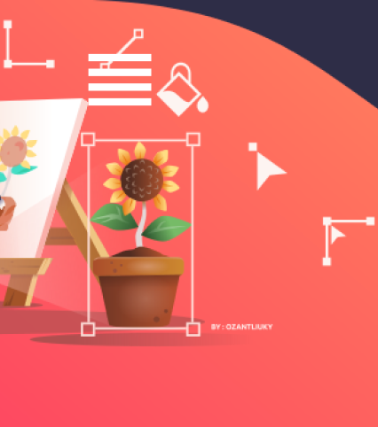

# Diseño responsive - DEMO - INKSCAPE -

# Tecnologias
- HTML
- CSS
- PREPROCESADOR -> SASS

## Diseño responsive para las siguientes dimensiones
- 430px
- 768px
- 1024px
- 1280px
- 1440px
- 1920px

## Modo de uso
1.Ejecuta en tu terminal el siguiente comando--> npm run dev
2.Copia el enlace que te proporciona en tu navegador.

### Contribución
Cualquier sugerencia o problema que encuentres no dudes en compartirlo! Gracias!!